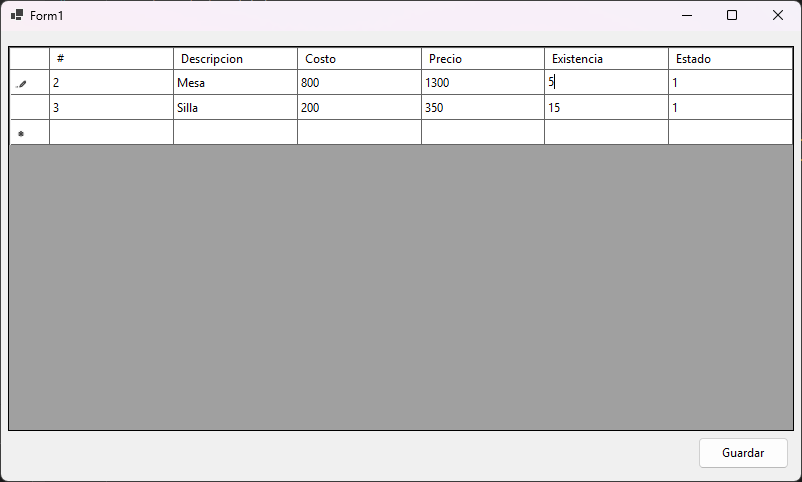

# Asignacion.Trabajo.Final

## Task
Realiza un programa en C# con Sql Server que permita crear un CRUD a una tabla de productos que tenga los siguientes campos:

- `codigoproducto` del tipo entero y clave principal.
- `descripcionproducto` del tipo varchar logintud de 35
- `costoproducto` del tipo money
- `precioproducto` del tipo money
- `existenciaproducto` del tipo entero
- `estatusproducto` del tipo varchar longitud 1

## User Interface

## Technologies
- C#
- Entity Framework Core
- SQL Server Express 2025
- Windows Forms (.NET 9)
- Visual Studio 2022

