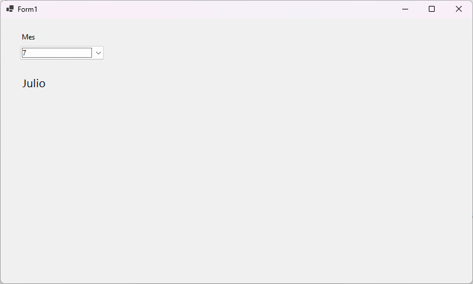

# Asignacion.Unidad.4

## Task
1) Realiza un programa en C# que llene un comboBox con los números del 1 al 12 (mediante código)
2) Al programa del punto #1 asignar un evento al hacer clic que muestre en un Label el nombre del mes depediendo del número selecionado, ejemplo:
- Al seleccionar 1 el Label Mostrará  Enero.
- Al seleccionar 2 el Label Mostrará  Febrero.
- Al seleccionar 3 el Label Mostrará  Marzo.
- Al seleccionar 4 el Label Mostrará  Abril.
- Al seleccionar 5 el Label Mostrará  Mayo.
- Al seleccionar 6 el Label Mostrará  Junio.
- Al seleccionar 7 el Label Mostrará  Julio.
- Al seleccionar 8 el Label Mostrará  Agosto.
- Al seleccionar 9 el Label Mostrará  Septiembre.
- Al seleccionar 10 el Label Mostrará  Octubre.
- Al seleccionar 11 el Label Mostrará  Noviembre.
- Al seleccionar 12 el Label Mostrará Diciembre.

## User Interface

## Technologies
- C#
- Windows Forms (.NET 9)
- Jetbrains Rider

