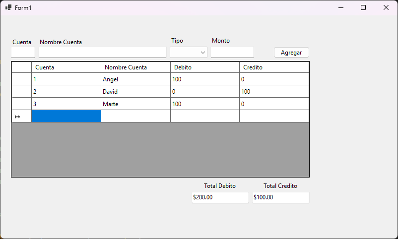

# Asignacion.Unidad.5

## Task
Realizar un programa que permita entrar los datos a un DataGridView de una entrada 
de diario, la idea es, cuando el usuario pulse clic en el botón Agregar, los datos
pasen al DataGridView, pero, el monto debe estar en la columna correspondiente. 
Si el tipo es Débito, el monto se debe ver en la columna Débito, en caso contrario 
en la Columna Crédito. Es importante ir totalizando en la parte de abajo el total 
de crédito y de débito. En caso de eliminar una fila del DatGridView los totales 
deben modificarse también.

## User Interface

## Technologies
- C#
- Windows Forms (.NET 9)
- Jetbrains Rider

