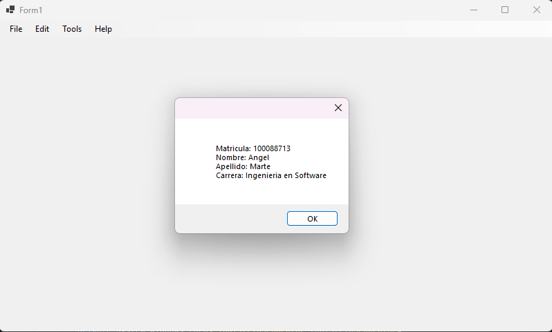

# Asignacion.Unidad.6

## Task
Elaborar  un programa con el objeto Menú, que muestre las opciones de bloc de notas (todas las opciones).
En la opción de ayuda agregar una opción que diga Autor, al pulsar clic en esta opción debe llamar
un formulario que muestre los siguientes datos personales referente a usted:
- Matricula.
- Nombre:
- Apellido:
- Carrera:

## User Interface

## Technologies
- C#
- Windows Forms (.NET 9)
- Jetbrains Rider

