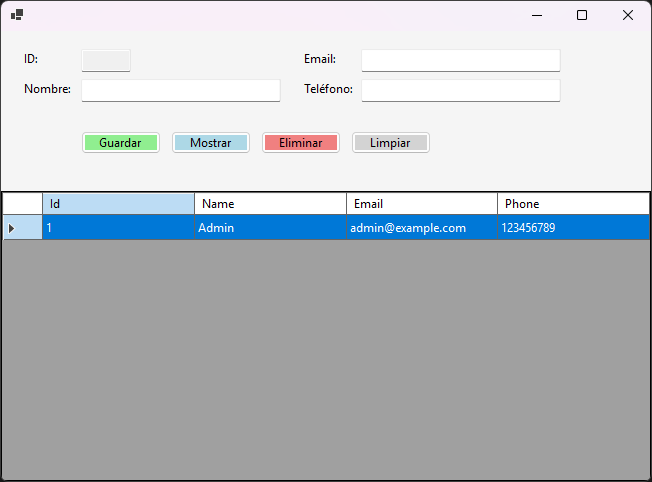

# Task 
## Parte 1: Investigación
Investigar las siguientes fuentes de acceso a datos:
- Bases de datos (MySQL, SQL Server, SQLite)
- Archivos locales (CSV, JSON, XML)
- APIs (servicios web)
- Sistemas en la nube

Para cada fuente incluir:
- Definición
- Ventajas y desventajas
- Ejemplo de uso
- Herramientas de conexión

## Parte 2: Desarrollo de la Interfaz
### 1. Elegir tecnología:
- _**Visual Studio (C#)**_
- Java
- Python (Tkinter)
- HTML + JavaScript

### 2. Diseñar la interfaz con:
- Formulario principal
- Campos de entrada
- Botones (Guardar, Mostrar, Eliminar)

### 3. Conectar con una fuente de datos (Base de datos o archivo).
### 4. Implementar funcionalidades:
- Insertar datos
- Consultar datos
- Actualizar datos
- Eliminar datos

### 5. Realizar pruebas de funcionamiento.
- Entrega Final
- Documento de investigación
- Código fuente
- Capturas de pantalla
- Video explicativo 

# User Interface

# Technologies
- C#
- Entity Framework Core
- MySQL 8.0.44
- Windows Forms (.NET 9)
- Visual Studio 2022